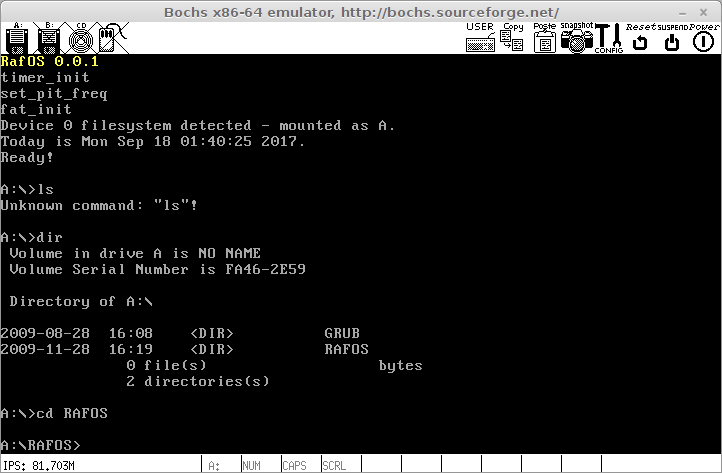

RafOS
=====

General
-------
RafOS is simple DOS-like x86 operating system made by me in school years as hobby project.

Building - Linux
----------------

Install tools:

	apt install mingw-w64 mtools bochs bochs-x

Generate Makefiles:

	tools/linux/premake5 gmake

Compile project:

	CC=i686-w64-mingw32-gcc CXX=i686-w64-mingw32-g++ make -C build

Build floppy image:

	scripts/linux/make-img.sh

Final floppy image is created in bin/floppy.img

To test run Bosch simulator:

	scripts/linux/run.sh

Building - Windows
------------------
Install MinGW.
Install ImDisk from: http://www.ltr-data.se/opencode.html/

Generate Makefiles:

	tools\windows\premake5 gmake

Compile project:

	mingw32-make -C build

Build floppy image:

	cd scripts\windows && make-img.bat

Final floppy image is created in bin/floppy.img

To test run Bosch simulator:

	cd scripts\windows && run.bat
